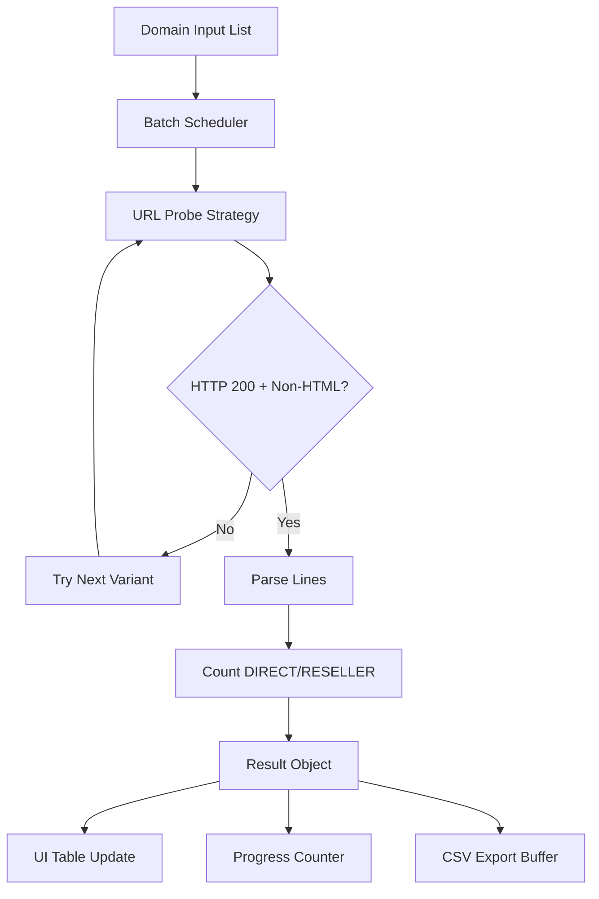

# Mass Ads & App-Ads Checker

A browser-native logging and validation toolkit for high-volume `ads.txt` / `app-ads.txt` checks with exportable operational diagnostics.

[](./manifest.json)
[](https://developer.chrome.com/docs/extensions/)
[](LICENSE)
[](./manifest.json)

> [!NOTE]
> This repository ships as a Chrome Extension focused on AdOps validation workflows. The “logging library” terminology in this README refers to its structured result tracking, status reporting, and CSV observability outputs.

## Table of Contents

- [Features](#features)
- [Tech Stack & Architecture](#tech-stack--architecture)
- [Getting Started](#getting-started)
- [Testing](#testing)
- [Deployment](#deployment)
- [Usage](#usage)
- [Configuration](#configuration)
- [License](#license)
- [Contacts & Community Support](#contacts--community-support)

## Features

- High-throughput batch domain scanning with controlled concurrency for stable browser execution.
- Multi-protocol endpoint probing sequence to maximize discovery success:
  - `https://www.<domain>/<fileType>`
  - `https://<domain>/<fileType>`
  - `http://www.<domain>/<fileType>`
  - `http://<domain>/<fileType>`
- Content-type sanity filtering to skip false-positive HTML error pages.
- IAB-centric record parsing that counts only `DIRECT` and `RESELLER` rows as valid.
- Real-time progress telemetry (`completed/total`) and status transitions (`Ready` -> `Processing` -> `Completed`).
- Downloadable CSV report artifact for BI ingestion, spreadsheet QA, or audit handoff.
- Persistent UI personalization via theme state (`light` / `dark`) stored in `localStorage`.
- Browser-side operation model that helps bypass server-side anti-bot behavior that blocks headless scripts.

> [!TIP]
> For very large input lists, split domains into chunks (for example 300-500 domains per run) to reduce browser memory pressure and keep UI interactions responsive.

## Tech Stack & Architecture

### Core Languages, Platform, and Dependencies

- Language: Vanilla JavaScript (ES6+) and HTML/CSS.
- Runtime: Chrome Extension popup context (Manifest V3).
- Network layer: Browser-native `fetch` with `AbortController` timeout protection.
- Persistence: Web Storage API (`localStorage`) for theme preference.
- Export pipeline: `Blob` + object URL download flow for CSV generation.
- External package dependencies: none (zero-install runtime in browser).

### Project Structure

```text
AdOps-Txt-Scanner/
├── manifest.json        # Extension metadata and permissions
├── background.js        # Window/popup launch behavior
├── popup.html           # UI markup + CSS theme tokens
├── popup.js             # Scanner logic, parsing, progress, CSV export
├── icons/
│   └── icon128.png      # Extension icon asset
├── LICENSE              # MIT license text
└── README.md            # Project documentation
```

### Key Design Decisions

1. Browser-first execution
   - Avoids common server-side HTTP fingerprinting barriers.
   - Keeps the validation loop close to end-user workflows.

2. Deterministic probing strategy
   - Ordered URL fallback reduces false negatives.
   - Fast-exit behavior returns immediately on first valid textual response.

3. Lightweight structured logging model
   - Each scan result emits a normalized record:
     - `domain`
     - `status`
     - `lines`
     - `url`
     - `cssClass`
   - This schema is mirrored in UI rows and CSV output for consistency.

4. Defensive parsing model
   - Removes BOM artifacts.
   - Strips comments and validates semantic token position.



> [!IMPORTANT]
> This extension validates accessibility and basic semantic formatting of seller declarations. It does not verify business authenticity, contractual validity, or financial settlement integrity.

## Getting Started

### Prerequisites

- Google Chrome (current stable recommended).
- Access to `chrome://extensions/`.
- Git (for cloning and updating source).

### Installation

1. Clone the repository:

```bash
git clone https://github.com/<your-org>/AdOps-Txt-Scanner.git
cd AdOps-Txt-Scanner
```

2. Load the extension unpacked:

```text
Chrome -> chrome://extensions/ -> Enable Developer mode -> Load unpacked -> Select AdOps-Txt-Scanner folder
```

3. Open the extension popup and run a smoke check with 2-3 domains.

> [!WARNING]
> Corporate endpoint security products may block non-HTTPS probes. If scans unexpectedly fail, test from a clean browser profile first.

## Testing

This project does not currently include an automated unit/integration test framework. Use the following quality checks:

```bash
# JavaScript syntax validation
node --check popup.js

# Validate extension manifest JSON format
python -m json.tool manifest.json > /dev/null

# Optional: inspect pending changes before release
git status --short
```

Manual validation checklist:

1. Load extension in Chrome and confirm popup renders.
2. Toggle `Light` / `Dark` theme and reopen popup to verify persistence.
3. Run scan against known domains with valid `ads.txt` and invalid endpoints.
4. Export CSV and confirm row schema + field ordering.

## Deployment

### Production Packaging

```bash
# From repository root
zip -r adops-txt-scanner.zip manifest.json popup.html popup.js background.js icons LICENSE README.md
```

### CI/CD Integration Guidelines

- Add a pipeline stage for syntax checks (`node --check popup.js`).
- Add a JSON lint stage for `manifest.json`.
- Run extension smoke tests in ephemeral Chrome profiles (optional advanced stage).
- Publish signed package through Chrome Web Store release channels (draft -> trusted testers -> public).

### Containerization

Containerization is not required for runtime because the artifact is a browser extension. If needed, use containers only for CI verification steps (linting, packaging, validation scripts).

> [!CAUTION]
> Never commit Web Store private keys, OAuth client secrets, or publishing credentials to this repository.

## Usage

### 1) Initialize a Basic Scan Session

```javascript
// Example invocation model aligned with popup.js behavior
const fileType = 'ads.txt';
const domains = ['example.com', 'google.com'];

for (const domain of domains) {
  // checkDomainSmart probes URL variants and returns normalized result payload
  const result = await checkDomainSmart(domain, fileType);
  console.log(result.status, result.lines, result.url);
}
```

### 2) Parse and Count Valid Seller Lines

```javascript
// countValidLines ignores comments and only accepts DIRECT/RESELLER
const content = `
# comment line
google.com, pub-123, DIRECT
example.org, pub-456, RESELLER
`;

const validCount = countValidLines(content);
console.log(validCount); // 2
```

### 3) Export Aggregated Results as CSV

```javascript
let csv = 'File URL,Status,Lines\n';
results.forEach((r) => {
  const rowUrl = r.url !== '-' ? r.url : r.domain;
  csv += `${rowUrl},${r.status},${r.lines}\n`;
});

const blob = new Blob([csv], { type: 'text/csv;charset=utf-8;' });
const url = URL.createObjectURL(blob);
```

## Configuration

### Runtime Options

- `fileTypeSelect`
  - Values: `ads.txt` or `app-ads.txt`.
  - Effect: Changes endpoint suffix used in URL probing.

- `batchSize` (defined in `popup.js`)
  - Current default: `2`.
  - Effect: Controls number of concurrent domain checks.

- Request timeout
  - Current default: `20000` ms using `AbortController`.
  - Effect: Prevents long-hanging network calls.

### Environment Variables (`.env`)

No `.env` variables are required for current runtime.

> [!NOTE]
> If you later migrate this scanner into a backend service, introduce `.env` keys for timeout, concurrency, and retry budgets to support predictable production behavior.

### Startup Flags and Config Files

- No CLI startup flags are currently used.
- Primary config surfaces are:
  - `manifest.json` for extension metadata.
  - UI controls in `popup.html`.
  - Runtime constants in `popup.js`.

## License

This project is distributed under the MIT License. See [`LICENSE`](LICENSE) for the full legal text.

## Contacts & Community Support

## Support the Project

[](https://www.patreon.com/OstinFCT)
[](https://ko-fi.com/fctostin)
[](https://boosty.to/ostinfct)
[](https://www.youtube.com/@FCT-Ostin)
[](https://t.me/FCTostin)

If you find this tool useful, consider leaving a star on GitHub or supporting the author directly.
